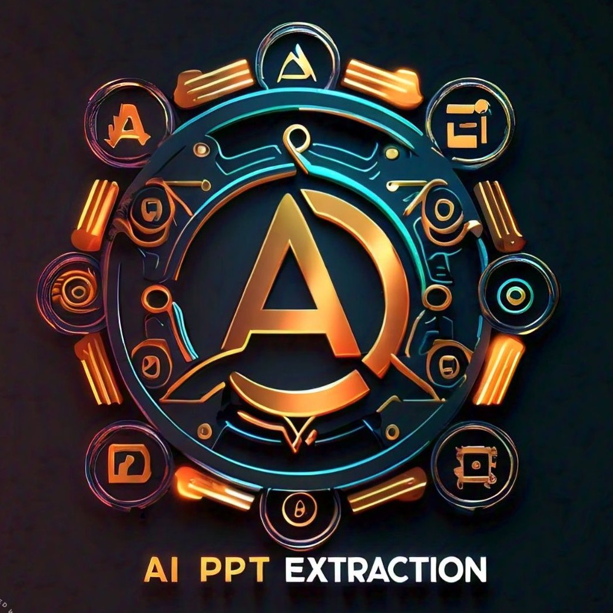
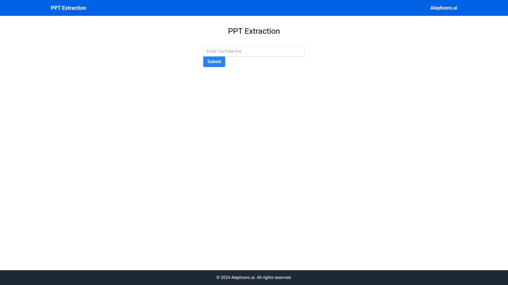

<div align="center">

  
  <h1>AI PPT Extraction</h1>
  
  <p>
    Transforming Videos into Professional Presentations Instantly.
  </p>
  
  
<!-- Badges -->
<p>
  <a href="https://github.com/AlephZeroConsulting/AI-PPT-Extraction/graphs/contributors">
    
  </a>
  <a href="">
    
  </a>
  <a href="https://github.com/AlephZeroConsulting/AI-PPT-Extraction/network/members">
    
  </a>
  <a href="https://github.com/AlephZeroConsulting/AI-PPT-Extraction/stargazers">
    
  </a>
  <a href="https://github.com/AlephZeroConsulting/AI-PPT-Extraction/issues/">
    
  </a>
  <a href="https://github.com/AlephZeroConsulting/AI-PPT-Extraction/blob/master/LICENSE">
    
  </a>
</p>
   
<h4>
    <a href="https://github.com/AlephZeroConsulting/AI-PPT-Extraction/">View Demo</a>
  <span> · </span>
    <a href="https://github.com/AlephZeroConsulting/AI-PPT-Extraction">Documentation</a>
  <span> · </span>
    <a href="https://github.com/AlephZeroConsulting/AI-PPT-Extraction/issues/">Report Bug</a>
  <span> · </span>
    <a href="https://github.com/AlephZeroConsulting/AI-PPT-Extraction/issues/">Request Feature</a>
  </h4>
</div>

<br />

<!-- Table of Contents -->
# :notebook_with_decorative_cover: Table of Contents

- [:notebook\_with\_decorative\_cover: Table of Contents](#notebook_with_decorative_cover-table-of-contents)
  - [:star2: About the Project](#star2-about-the-project)
    - [:camera: Screenshots](#camera-screenshots)
  - [Features](#features)
    - [:space\_invader: Tech Stack](#space_invader-tech-stack)
  - [:toolbox: Getting Started](#toolbox-getting-started)
    - [:bangbang: Prerequisites](#bangbang-prerequisites)
    - [Installation](#installation)
    - [Frontend](#frontend)
    - [Backend](#backend)
  - [:eyes: Usage](#eyes-usage)
  - [FAQ](#faq)
  - [:wave: Contributing](#wave-contributing)
    - [:scroll: Code of Conduct](#scroll-code-of-conduct)
  - [:warning: License](#warning-license)
  - [:handshake: Contact](#handshake-contact)

  

<!-- About the Project -->
## :star2: About the Project
AI PPT Extraction is an innovative tool designed to transform YouTube videos into comprehensive PowerPoint presentations. By leveraging advanced AI technology, our platform automates the extraction of key frames and relevant content, simplifying the process of creating presentations.

<!-- Screenshots -->
### :camera: Screenshots

<div align="center"> 
  
</div>


## Features

- **Effortless YouTube Integration**: Enter a YouTube link, and our system handles the download and extraction.
- **Intuitive ROI Drawing**: Highlight key sections with our user-friendly ROI selector.
- **Real-Time Processing Status**: Stay informed with updates every 10 seconds.
- **Instant Download**: Download your customized PowerPoint presentation with a single click.

<!-- TechStack -->
### :space_invader: Tech Stack


  <ul>
    <li><a href="https://reactjs.org/">React.js</a></li>
    <li><a href="https://tailwindcss.com/">TailwindCSS</a></li>
    <li><a href="https://fastapi.tiangolo.com/">Fastapi</a></li>
  </ul>


<!-- Getting Started -->
## 	:toolbox: Getting Started

<!-- Prerequisites -->
### :bangbang: Prerequisites

<ul>
    <li><a href="https://nodejs.org/en/download/package-manager">npm</a></li>
    <li><a href="https://www.python.org/downloads/">Python</a></li>
  </ul>


### Installation

### Frontend

1. Clone the repository:
    ```bash
    git clone https://github.com/AlephZeroConsulting/AI-PPT-Extraction.git
    cd AI-PPT-Extraction/frontend
    ```

2. Install the dependencies:
    ```bash
    npm install
    ```

3. Start the development server:
    ```bash
    npm start
    ```

### Backend

1. Navigate to the backend directory:
    ```bash
    cd ../backend
    ```

2. Create a virtual environment and activate it:
    ```bash
    python -m venv venv
    source venv/bin/activate  # On Windows use `venv\Scripts\activate`
    ```

3. Install the dependencies:
    ```bash
    pip install -r requirements.txt
    ```

4. Run the FastAPI server:
    ```bash
    uvicorn main:app --reload
    ```

<!-- Usage -->
## :eyes: Usage


1. Open your browser and navigate to `http://localhost:3000`.
2. Enter the YouTube link in the input box and submit.
3. Draw a rectangle ROI on the displayed image.
4. Wait for the processing to complete (updates every 10 seconds).
5. Download your PPT once it's ready.

## FAQ


<!-- Contributing -->
## :wave: Contributing

<a href="https://github.com/AlephZeroConsulting/AI-PPT-Extraction/graphs/contributors">
  
</a>


Contributions are always welcome!

See `contributing.md` for ways to get started.


<!-- Code of Conduct -->
### :scroll: Code of Conduct

Please read the [Code of Conduct](https://github.com/AlephZeroConsulting/AI-PPT-Extraction/blob/master/CODE_OF_CONDUCT.md)


<!-- License -->
## :warning: License

Distributed under Apache2.0. See LICENSE for more information.


<!-- Contact -->
## :handshake: Contact

Guy Regev - [@regevguy](https://www.linkedin.com/in/regevguy/) - guy@alephzero.ai

Project Link: [https://github.com/AlephZeroConsulting/AI-PPT-Extraction](https://github.com/AlephZeroConsulting/AI-PPT-Extraction)

